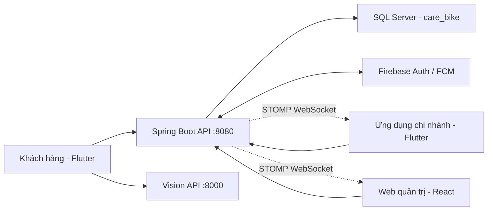

# CareBike

> Nền tảng quản lý bảo trì xe máy, đặt lịch sửa chữa và điều phối cứu hộ theo thời gian thực, kết hợp AI để hỗ trợ kiểm tra tình trạng xe.

CareBike kết nối khách hàng, chi nhánh và quản trị viên trong một hệ thống thống nhất. Khách hàng sử dụng ứng dụng Flutter để quản lý xe, đặt lịch hoặc gọi cứu hộ; nhân viên chi nhánh xử lý yêu cầu và lập hóa đơn; quản trị viên theo dõi hoạt động trên web.

## Thành phần hệ thống

| Thành phần | Công nghệ | Vai trò |
| --- | --- | --- |
| Backend | Java 21, Spring Boot 4, Spring Security, JPA | REST API, nghiệp vụ, xác thực, thông báo và WebSocket |
| Web | React 19, TypeScript, Vite | Quản trị hệ thống và quản lý chi nhánh |
| Mobile | Flutter, Dart, Provider | Ứng dụng khách hàng và ứng dụng vận hành tại chi nhánh |
| Vision API | Python, FastAPI, Ultralytics YOLO | Phân tích ảnh kiểm tra tình trạng xe |
| Database | Microsoft SQL Server | Lưu người dùng, xe, lịch hẹn, cứu hộ, hóa đơn và lịch sử bảo trì |
| Authentication | Firebase Authentication | Đăng nhập, xác thực token và gửi thông báo FCM |



## Tính năng chính

### Khách hàng

- Đăng ký, đăng nhập bằng Firebase và quản lý hồ sơ cá nhân.
- Quản lý phương tiện, biển số, số khung, số máy và số kilomet hiện tại.
- Xem lịch sử bảo trì và chi tiết dịch vụ đã sử dụng.
- Đặt lịch sửa chữa trong giờ làm việc từ **08:00 đến 20:00**.
- Hủy lịch hẹn và nhận cập nhật trạng thái theo thời gian thực.
- Gọi cứu hộ 24/7, gửi vị trí, phương tiện và mô tả sự cố.
- Nhận thông tin chi nhánh và nhân viên được phân công.
- Quét QR, theo dõi hóa đơn tạm và hoàn tất thanh toán.
- Kiểm tra ảnh xe bằng mô hình YOLO và nhận gợi ý từ Gemini AI.

### Chi nhánh và nhân viên

- Quản lý lịch hẹn, yêu cầu cứu hộ và sửa chữa khách vãng lai.
- Tự động phân công đều công việc cho nhân viên đang trong ca.
- Chuyển yêu cầu cứu hộ sang chi nhánh gần tiếp theo khi chi nhánh hiện tại không còn nhân viên phù hợp.
- Xác thực đúng mã nhân viên đã được phân công trước khi lập hóa đơn.
- Chọn dịch vụ, phụ tùng, phí di chuyển, phí cứu kéo và tạo hóa đơn tạm.
- Đồng bộ realtime khi yêu cầu được tạo, cập nhật, hủy hoặc hoàn tất.
- Quản lý nhân viên, ca làm việc và trạng thái bận/rảnh.
- Theo dõi KPI theo nhân viên, số lịch hẹn và số đơn cứu hộ đã hoàn thành; hỗ trợ lọc theo ngày, tháng và năm.

### Quản trị viên

- Quản lý khách hàng, chi nhánh, nhân viên, danh mục và phụ tùng.
- Theo dõi dashboard thống kê toàn hệ thống.
- Quản lý dữ liệu bảo trì và hoạt động cứu hộ.
- Kiểm soát quyền truy cập theo vai trò `ADMIN`, `BRANCH` và `CUSTOMER`.

## Cấu trúc thư mục

```text
CareBike_Project/
├── backend-java/          # Spring Boot API và migration SQL
├── web-app/               # React/TypeScript dashboard
├── mobile_app/            # Flutter mobile application
├── python-vision-api/     # FastAPI và mô hình YOLO best.pt
├── database/              # Script khởi tạo SQL Server
├── docs/                  # Tài liệu thiết kế và sơ đồ kiến trúc
├── Images/                # Ảnh nguồn của phụ tùng
└── adb-reverse-all.ps1    # Nối cổng Android tới backend và Vision API
```

## Yêu cầu môi trường

- Java Development Kit 21.
- Node.js 20 trở lên và npm.
- Flutter SDK tương thích Dart `^3.11.4`.
- Python 3.10 trở lên.
- Microsoft SQL Server và SQL Server Management Studio.
- Android SDK/Android Studio nếu chạy ứng dụng Android.
- Một Firebase project và Firebase Admin service account.
- Gemini API key nếu sử dụng trợ lý AI.

## Cài đặt và chạy dự án

### 1. Clone source code

```powershell
git clone https://github.com/trunganh1406/CareBike.git
cd CareBike
```

### 2. Khởi tạo database

1. Mở SQL Server Management Studio.
2. Mở file [`database/care_bike_db.sql`](database/care_bike_db.sql).
3. Kiểm tra tên database là `care_bike` và thực thi toàn bộ script.

Nếu đang nâng cấp từ database cũ, chạy thêm các migration trong `backend-java/database/migrations/` theo thứ tự:

1. `20260716_unicode_text_columns.sql`
2. `20260716_balanced_staff_assignment.sql`
3. `20260716_rescue_completed_at.sql`

Các migration chuyển dữ liệu văn bản cần thiết sang Unicode, bổ sung thông tin phân công nhân viên và thời điểm hoàn tất cứu hộ.

### 3. Cấu hình Firebase và biến môi trường

Đặt Firebase Admin service account tại:

```text
backend-java/src/main/resources/carebike-firebase-adminsdk.json
```

File này đã được `.gitignore` và **không được commit lên GitHub**.

Thiết lập biến môi trường trong PowerShell trước khi chạy backend:

```powershell
$env:DB_USERNAME="sa"
$env:DB_PASSWORD="YOUR_SQL_SERVER_PASSWORD"
$env:GEMINI_API_KEY="YOUR_GEMINI_API_KEY"
```

Nếu SQL Server không chạy tại `localhost:1433`, chỉnh `spring.datasource.url` trong `backend-java/src/main/resources/application.properties` trên máy của bạn và không commit thông tin nhạy cảm.

### 4. Chạy backend

```powershell
cd backend-java
.\mvnw.cmd spring-boot:run
```

Backend mặc định chạy tại `http://localhost:8080` và REST API có tiền tố `/api`.

Chạy kiểm thử backend:

```powershell
.\mvnw.cmd test
```

### 5. Chạy web dashboard

Mở terminal mới tại thư mục gốc:

```powershell
cd web-app
npm ci
npm run dev
```

Web mặc định gọi API tại `http://localhost:8080/api`. Có thể ghi đè bằng biến `VITE_API_BASE_URL`.

Kiểm tra bản production:

```powershell
npm run build
```

### 6. Chạy Vision API

Mở terminal mới tại thư mục gốc:

```powershell
cd python-vision-api
python -m venv venv
.\venv\Scripts\Activate.ps1
pip install fastapi uvicorn python-multipart ultralytics pillow
python -m uvicorn main:app --host 0.0.0.0 --port 8000
```

Vision API sử dụng mô hình `python-vision-api/best.pt` và cung cấp endpoint `POST /api/vision/analyze`.

### 7. Chạy mobile app

Khi dùng máy ảo hoặc thiết bị Android qua ADB, chạy tại thư mục gốc:

```powershell
.\adb-reverse-all.ps1
```

Script sẽ nối cổng `8080` cho backend và `8000` cho Vision API. Sau đó:

```powershell
cd mobile_app
flutter pub get
flutter run
```

Mobile mặc định kết nối `127.0.0.1:8080` thông qua ADB reverse. Có thể thay địa chỉ Vision API khi build:

```powershell
flutter run --dart-define=VISION_API_URL=http://YOUR_SERVER_IP:8000
```

## Realtime và thông báo

- Backend mở STOMP WebSocket tại `ws://localhost:8080/ws`.
- Web và ứng dụng chi nhánh tự tải lại dữ liệu khi lịch hẹn, cứu hộ, nhân viên, ca làm hoặc phụ tùng thay đổi.
- Firebase Cloud Messaging gửi thông báo cho khách hàng và chi nhánh khi trạng thái yêu cầu thay đổi.

## Quy tắc database và tiếng Việt

- Dữ liệu có tiếng Việt phải dùng `NVARCHAR`/`NCHAR` trong SQL Server.
- Chuỗi Unicode viết trực tiếp trong SQL nên dùng tiền tố `N`, ví dụ `N'Kiểm tra xe'`.
- API trả dữ liệu với UTF-8; client gửi `Content-Type: application/json; charset=UTF-8`.
- Không sửa trực tiếp schema mà không bổ sung migration tương ứng.

## Bảo mật

Không commit các dữ liệu sau:

- Firebase Admin service account.
- Gemini API key hoặc token truy cập.
- Mật khẩu SQL Server.
- File `.env` và cấu hình riêng của máy.
- Dữ liệu khách hàng thật trong bản export database công khai.

Nếu một khóa bí mật từng xuất hiện trong Git, hãy thu hồi/đổi khóa; chỉ xóa khỏi file hiện tại là chưa đủ vì khóa vẫn có thể tồn tại trong lịch sử commit.

## Tài liệu

- [Tài liệu thiết kế](docs/design-document.md)
- [CareBike Design Document](docs/CareBike_Design_Document.docx)
- [Luồng AI](docs/carebike_ai_flows.html)
- [Kiến trúc hệ thống](docs/carebike_architecture.html)
- [CareBike Study Guide](CareBike_Study_Guide.pdf)
- [CareBike Study Guide - Dark](CareBike_Study_Guide_Dark.pdf)

## Kiểm tra trước khi đóng góp

```powershell
# Backend
cd backend-java
.\mvnw.cmd test

# Web
cd ..\web-app
npm run build

# Mobile
cd ..\mobile_app
flutter analyze
```

Trước khi push, dùng `git status` để chắc chắn không có `venv`, `node_modules`, khóa bí mật hoặc file cấu hình cá nhân trong commit.

## License

Đây là đồ án học tập. Việc sử dụng, sao chép hoặc triển khai lại cần có sự đồng ý của nhóm phát triển CareBike.
