# CareBike - Tài liệu nắm bắt các tính năng chính để bảo vệ đồ án

Tài liệu này tổng hợp các phần việc quan trọng trong project CareBike, tập trung vào 5 nhóm chức năng:

- Đăng nhập.
- Đăng ký.
- Role và phân quyền.
- Chatbot AI tư vấn bảo dưỡng.
- AI phân tích ảnh độ mòn, hư hỏng lốp xe.

Mục tiêu của tài liệu là giúp giải thích được: tính năng giải quyết vấn đề gì, người dùng đi qua luồng nào, dữ liệu đi qua mobile/web/backend/AI ra sao, và điểm mạnh/hạn chế của cách triển khai hiện tại.

## 1. Tổng quan kiến trúc

CareBike hiện được chia thành 4 khối chính:

| Khối | Vai trò | Công nghệ chính |
|---|---|---|
| Mobile app | Giao diện cho customer và branch staff/manager | Flutter |
| Web admin | Giao diện quản trị hệ thống, chi nhánh, nhân sự, phụ tùng, thông số lốp | React, TypeScript |
| Backend API | Xử lý nghiệp vụ, phân quyền, dữ liệu, tích hợp Firebase/Gemini | Spring Boot |
| Vision AI API | Phân tích ảnh lốp xe bằng model YOLO | FastAPI, Ultralytics YOLO |

Luồng dữ liệu tổng quát:

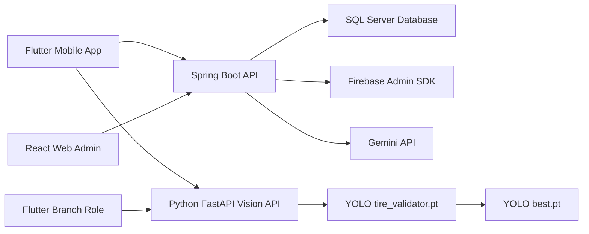

Diagram tương tác full-screen để trình bày kiến trúc:

- [Mở CareBike System Map](diagrams/carebike_system_map.html)

Sơ đồ đọc nhanh theo các điểm nhấn khi bảo vệ:

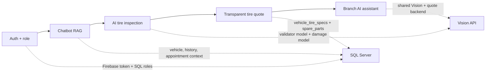

Các file cấu hình, kết nối chính:

- Mobile API client: `mobile_app/lib/core/network/api_client.dart`
- Mobile Vision config: `mobile_app/lib/core/config/ai_config.dart`
- Web API client: `web-app/src/services/apiClient.ts`
- Backend security: `backend-java/src/main/java/com/carebike/backend/config/SecurityConfig.java`
- Firebase backend init: `backend-java/src/main/java/com/carebike/backend/config/FirebaseConfig.java`
- Vision API: `python-vision-api/main.py`

## 2. Đăng nhập, đăng ký và đồng bộ tài khoản

### 2.1. Tư tưởng thiết kế

Project không tự viết hệ thống mật khẩu từ đầu. Thay vào đó:

- Firebase Authentication quản lý tài khoản, mật khẩu, Google Sign-In và phiên đăng nhập.
- Spring Boot backend dùng Firebase Admin SDK để kiểm tra ID token.
- Database CareBike lưu hồ sơ nghiệp vụ riêng: user id nội bộ, họ tên, số điện thoại, role, trạng thái hoạt động.

Điểm mạnh của cách này:

- Không phải tự lưu password trong database.
- Tận dụng cơ chế token, đăng nhập Google, reset password của Firebase.
- Backend vẫn kiểm soát được quyền nghiệp vụ bằng role trong bảng `users/roles`.

### 2.2. Các bảng chính

#### Bảng `roles`

Entity: `backend-java/src/main/java/com/carebike/backend/features/auth/entity/Role.java`

| Field | Ý nghĩa |
|---|---|
| `id` | Khóa chính |
| `role_name` | Tên role, ví dụ `ADMIN`, `BRANCH`, `CUSTOMER` |

#### Bảng `users`

Entity: `backend-java/src/main/java/com/carebike/backend/features/auth/entity/User.java`

| Field | Ý nghĩa |
|---|---|
| `id` | ID nội bộ trong CareBike |
| `firebase_uid` | ID tài khoản từ Firebase |
| `email` | Email đăng nhập |
| `full_name` | Họ tên |
| `phone` | Số điện thoại |
| `dob`, `gender` | Hồ sơ cá nhân |
| `role_id` | Role của user |
| `is_active` | Khóa/mở tài khoản |
| `created_at` | Ngày tạo |

### 2.3. Seed role mặc định

File: `backend-java/src/main/java/com/carebike/backend/config/DataSeeder.java`

Khi backend khởi động, nếu bảng `roles` đang trống thì hệ thống tạo 3 role mặc định:

- `ADMIN`
- `BRANCH`
- `CUSTOMER`

Seeder cũng tạo tài khoản Super Admin mặc định nếu chưa tồn tại. Đây là cách giúp hệ thống có tài khoản quản trị ban đầu để đăng nhập web admin.

### 2.4. Luồng đăng ký customer trên mobile

File mobile:

- `mobile_app/lib/features/auth/screens/register_screen.dart`
- `mobile_app/lib/features/auth/providers/auth_provider.dart`

File backend:

- `backend-java/src/main/java/com/carebike/backend/features/auth/controller/AuthController.java`
- `backend-java/src/main/java/com/carebike/backend/features/auth/dto/RegisterRequest.java`

Luồng xử lý:

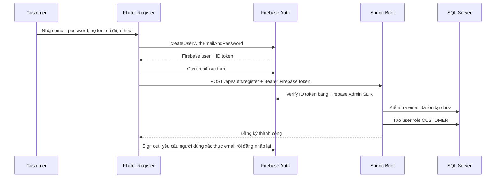

Điểm đáng chú ý:

- Mobile tạo tài khoản Firebase trước.
- Backend chỉ tạo user CareBike nếu Firebase token hợp lệ.
- Nếu backend trả lỗi, mobile xóa user Firebase vừa tạo để tránh lệch dữ liệu.
- Customer luôn được gán role `CUSTOMER` ở backend, người dùng không được tự gửi role từ client.

### 2.5. Luồng đăng nhập customer/branch trên mobile

File mobile:

- `mobile_app/lib/features/auth/screens/login_screen.dart`
- `mobile_app/lib/features/auth/providers/auth_provider.dart`
- `mobile_app/lib/app/auth_wrapper.dart`

Luồng xử lý:

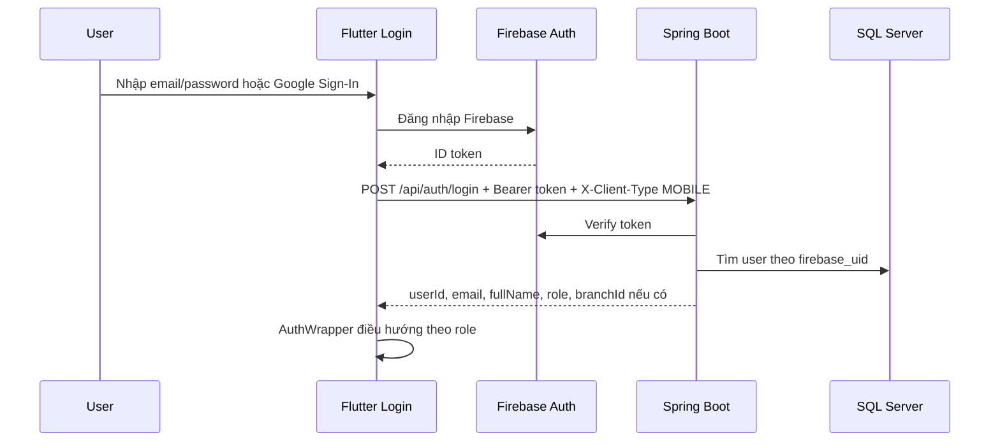

Điều hướng sau khi đăng nhập:

- Nếu role là `BRANCH`: vào `BranchMobileDashboard`.
- Các trường hợp còn lại trên mobile: vào `MainScreen` của customer.
- Nếu role là `ADMIN` đăng nhập mobile, backend từ chối vì admin phải dùng web dashboard.

### 2.6. Luồng đăng nhập web admin/branch

File web:

- `web-app/src/pages/Login.tsx`
- `web-app/src/context/AuthContext.tsx`
- `web-app/src/services/authService.ts`
- `web-app/src/routes/ProtectedRoute.tsx`
- `web-app/src/routes/RoleRoute.tsx`
- `web-app/src/App.tsx`

Luồng xử lý:

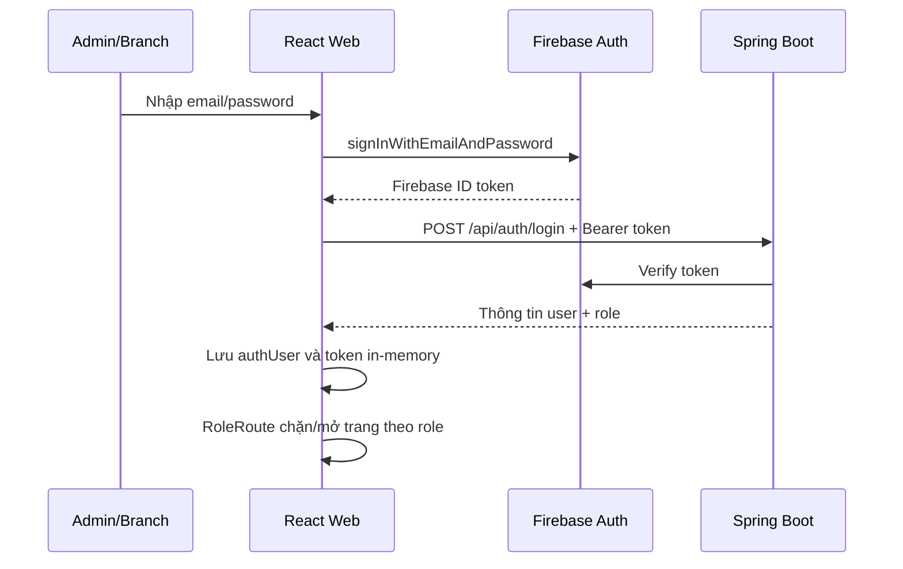

Quy tắc:

- Customer không được đăng nhập web admin.
- Admin vào các trang quản trị như staff, branches, customers, categories, spare parts, tire specs.
- Branch vào các trang nghiệp vụ chi nhánh như staff chi nhánh, shifts, history, KPI.

### 2.7. Backend xác thực token và phân quyền

File:

- `backend-java/src/main/java/com/carebike/backend/security/JwtAuthenticationFilter.java`
- `backend-java/src/main/java/com/carebike/backend/config/SecurityConfig.java`

Luồng filter:

1. Lấy header `Authorization: Bearer <Firebase ID token>`.
2. Dùng Firebase Admin SDK verify token.
3. Lấy `firebaseUid`.
4. Với API `/api/auth/**`, filter gắn token vào request để register/login xử lý.
5. Với API khác, backend tìm user trong database theo `firebase_uid`.
6. Nếu có user, backend tạo Spring Security authentication với authority dạng `ROLE_ADMIN`, `ROLE_BRANCH`, `ROLE_CUSTOMER`.

Security config hiện có các rule chính:

- `/api/auth/**`, `/error`, `/ws/**`, `/images/**`: public.
- `/api/admin/**`: chỉ `ADMIN`.
- `/api/branch/**`: `ADMIN` hoặc `BRANCH`.
- `/api/appointments/**`: `CUSTOMER`, `BRANCH`, `ADMIN`.
- `/api/ai/**`: mọi user đã xác thực.
- Các API còn lại: cần đăng nhập.

Lưu ý khi trình bày: frontend có RoleRoute để tối ưu trải nghiệm, nhưng bảo mật thật sự phải nằm ở backend. Frontend chỉ là lớp điều hướng, không thể thay thế phân quyền server.

## 3. Tạo role và quản lý tài khoản staff/branch

### 3.1. Role có được tạo từ form không?

Hiện tại hệ thống không cho admin tạo role tùy ý từ UI. Role được seed cố định để kiểm soát nghiệp vụ:

- `ADMIN`: quản trị toàn hệ thống.
- `BRANCH`: quản lý/nhân sự chi nhánh trên dashboard.
- `CUSTOMER`: khách hàng dùng mobile app.

Điều admin làm trên UI là tạo tài khoản quản lý chi nhánh, backend tự gán role `BRANCH`.

### 3.2. Tạo tài khoản quản lý chi nhánh

File web:

- `web-app/src/pages/StaffManagement.tsx`
- `web-app/src/components/modals/StaffModal.tsx`
- `web-app/src/services/authService.ts`

File backend:

- `backend-java/src/main/java/com/carebike/backend/features/auth/controller/AuthController.java`
- `backend-java/src/main/java/com/carebike/backend/features/auth/service/UserService.java`

Luồng xử lý:

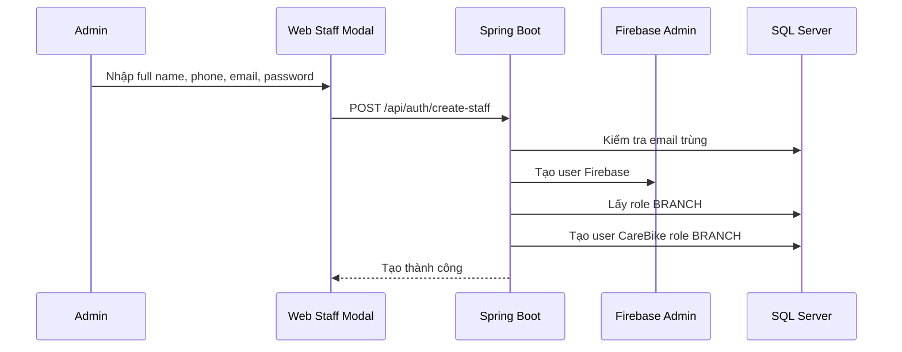

Ưu điểm:

- Admin không phải thao tác trực tiếp trên Firebase Console.
- Firebase và SQL Server được đồng bộ trong một service nghiệp vụ.
- Role `BRANCH` được quyết định ở backend, tránh client giả mạo role.

### 3.3. Khóa/mở khóa và xóa tài khoản staff

File backend:

- `backend-java/src/main/java/com/carebike/backend/features/auth/controller/UserController.java`
- `backend-java/src/main/java/com/carebike/backend/features/auth/service/UserService.java`

Chức năng:

- `GET /api/users`: lấy danh sách user.
- `PUT /api/users/{id}/toggle-status`: khóa hoặc mở tài khoản.
- `DELETE /api/users/{id}`: xóa tài khoản staff.

Khi xóa staff:

- Backend kiểm tra tài khoản đó có đang quản lý chi nhánh nào không.
- Nếu đang quản lý chi nhánh, không cho xóa.
- Nếu được xóa, backend xóa cả Firebase user và database user.

### 3.4. Gán manager cho chi nhánh

File:

- `backend-java/src/main/java/com/carebike/backend/features/branch/controller/BranchController.java`
- `backend-java/src/main/java/com/carebike/backend/features/branch/service/BranchService.java`

Branch lưu `manager_id`. Khi cập nhật chi nhánh:

- Nếu manager mới đang quản lý chi nhánh khác, service gỡ manager khỏi chi nhánh cũ.
- Sau đó gán manager mới vào chi nhánh hiện tại.

Điều này tránh một tài khoản branch manager bị gán chồng cho nhiều chi nhánh.

## 4. Chatbot AI tư vấn bảo dưỡng

### 4.1. Mục tiêu tính năng

Chatbot không chỉ trả lời câu hỏi chung chung. Nó đóng vai trò "Maintenance Copilot":

- Biết người dùng đang chọn xe nào.
- Đọc dữ liệu xe, số km hiện tại, lịch hẹn, lịch sử bảo dưỡng.
- Phân loại ý định câu hỏi: dầu nhớt, phanh, lốp, cứu hộ, đặt lịch, lịch sử.
- Trả lời ngắn gọn, có quyết định hoặc bước tiếp theo.
- Hiển thị thẻ sức khỏe xe và nút hành động trực tiếp.

### 4.2. File chính

Mobile:

- `mobile_app/lib/features/chat/screens/support_chat_screen.dart`
- `mobile_app/lib/features/home/screens/home_tab.dart`

Backend:

- `backend-java/src/main/java/com/carebike/backend/features/ai/controller/AiController.java`
- `backend-java/src/main/java/com/carebike/backend/features/ai/service/GeminiApiService.java`
- `backend-java/src/main/java/com/carebike/backend/features/ai/dto/AiConsultRequest.java`
- `backend-java/src/main/java/com/carebike/backend/features/ai/dto/AiConsultResponse.java`
- `backend-java/src/main/java/com/carebike/backend/features/ai/dto/AiHealthCard.java`
- `backend-java/src/main/java/com/carebike/backend/features/ai/dto/AiSuggestedAction.java`

Database liên quan:

- `vehicles`
- `appointments`
- `maintenance_history`

### 4.3. API chatbot

Endpoint:

```http
POST /api/ai/consult
```

Request:

```json
{
  "customerId": 12,
  "vehicleId": 1,
  "message": "When should I change my oil?"
}
```

Response dạng chính:

```json
{
  "reply": "Your Honda Winner's oil is due for a change soon...",
  "vehicleId": 1,
  "vehicleLabel": "Honda Winner - 59C2-90490",
  "intent": "OIL",
  "urgency": "LOW",
  "healthCards": [
    {
      "label": "Oil",
      "status": "Due soon",
      "detail": "Last oil service: 2026-07-14, 9090 km since then",
      "tone": "warning"
    }
  ],
  "actions": [
    {
      "type": "BOOKING",
      "label": "Book oil service",
      "payload": "1"
    }
  ]
}
```

### 4.4. RAG trong project này là gì?

Trong project này, RAG nên được hiểu là "retrieval-augmented response từ dữ liệu có cấu trúc", không phải vector RAG phức tạp.

Backend truy xuất dữ liệu thật từ database:

- Danh sách xe của customer.
- Xe đang được chọn.
- Lịch hẹn gần đây.
- Lịch sử bảo dưỡng.
- Số km hiện tại.

Sau đó backend đóng gói dữ liệu này vào prompt gửi lên Gemini. Gemini sinh câu trả lời dựa trên context đã được backend cung cấp.

Luồng:

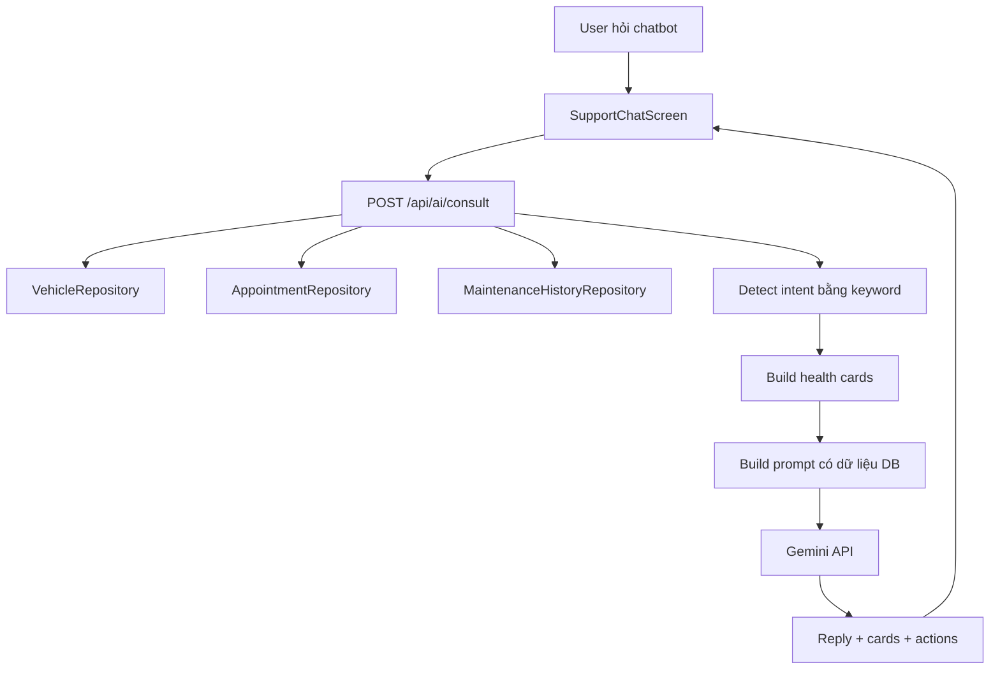

### 4.5. Phân loại intent

Trong `GeminiApiService`, backend dùng keyword đơn giản để phân loại:

| Intent | Ví dụ keyword |
|---|---|
| `OIL` | oil, nhớt, dầu máy |
| `BRAKE` | brake, phanh, thắng |
| `TIRE` | tire, tyre, lốp, vỏ xe |
| `BOOKING` | book, appointment, đặt lịch |
| `RESCUE` | rescue, sos, emergency |
| `HISTORY` | history, lịch sử |
| `GENERAL` | còn lại |

### 4.6. Health cards

Backend tạo 3 thẻ sức khỏe:

- Oil
- Brake
- Tire

Ví dụ logic dầu nhớt:

- Hệ thống tìm lần thay nhớt gần nhất trong appointment completed hoặc maintenance history.
- So sánh với `currentKm` của xe.
- Ngưỡng hiện tại:
  - 2.000 km.
  - 90 ngày.
- Nếu vượt ngưỡng, card hiển thị `Due soon`.

Ví dụ logic phanh/lốp:

- Tìm record bảo dưỡng gần nhất theo keyword.
- Ngưỡng kiểm tra hiện tại là 180 ngày.
- Nếu quá lâu chưa có record, card có thể là `Check soon` hoặc `Unknown`.

### 4.7. Suggested actions

Chatbot trả về actions để UI tạo nút bấm:

| Action | Ý nghĩa trên mobile |
|---|---|
| `SELECT_VEHICLE` | Người dùng chọn xe nếu có nhiều xe |
| `AI_TIRE_SCAN` | Mở luồng AI tire inspection |
| `BOOKING` | Quay về Home và điền sẵn form đặt lịch |
| `RESCUE` | Mở bottom sheet cứu hộ |
| `VIEW_HISTORY` | Mở lịch sử bảo dưỡng |
| `ADD_VEHICLE` | Gợi ý vào My Vehicles để thêm xe |

Điểm hay khi bảo vệ:

- Chatbot không chỉ trả lời, mà biến câu trả lời thành thao tác.
- AI không tự đặt lịch thay người dùng. Nó chỉ đề xuất và pre-fill form. Người dùng vẫn xác nhận branch, ngày, giờ.
- Đây là thiết kế an toàn cho nghiệp vụ có phát sinh dịch vụ/chi phí.

### 4.8. Fallback khi Gemini lỗi

Nếu Gemini API lỗi, backend không trả lỗi trắng. `GeminiApiService` có rule-based fallback:

- Dầu nhớt: nhắc xem oil card và đặt lịch nếu due soon.
- Lốp: nhắc dùng AI Tire Scan và đặt technician check nếu thấy mòn.
- Phanh: nhắc kiểm tra sớm nếu phanh mềm.
- Cứu hộ: nhắc dừng xe và gọi rescue nếu xe mất an toàn.

Điều này giúp trải nghiệm ổn định hơn khi AI cloud tạm thời lỗi.

## 5. AI phân tích ảnh độ mòn lốp xe cho customer

### 5.1. Bài toán

Người dùng muốn biết lốp xe có dấu hiệu mòn/hư hỏng không chỉ bằng ảnh. Tuy nhiên, một ảnh đơn lẻ không thể chứng minh toàn bộ lốp an toàn.

Vì vậy hệ thống được thiết kế theo hướng:

- Quick scan: nhanh, một ảnh, phù hợp phát hiện lỗi rõ.
- Guided full check: 5 ảnh theo góc hướng dẫn, tăng độ bao phủ.
- Tách confidence thành 2 chỉ số:
  - Detection confidence: model tự tin bao nhiêu với lỗi nhìn thấy.
  - Inspection completeness: bộ ảnh bao phủ lốp tốt đến đâu.
- Kết quả tập trung vào quyết định của người dùng:
  - Có nên đi tiếp không?
  - Có cần đặt lịch kiểm tra không?
  - Có nên chạy guided check không?

### 5.2. File chính

Mobile customer:

- `mobile_app/lib/features/home/main_screen.dart`
- `mobile_app/lib/features/inspection/screens/inspection_flow.dart`
- `mobile_app/lib/features/inspection/screens/inspection_result_screen.dart`
- `mobile_app/lib/features/inspection/services/vision_api_service.dart`
- `mobile_app/lib/features/inspection/models/damage_models.dart`
- `mobile_app/lib/features/inspection/models/tire_quote_models.dart`

Vision API:

- `python-vision-api/main.py`
- `python-vision-api/best.pt`

Backend báo giá lốp:

- `backend-java/src/main/java/com/carebike/backend/features/tire/controller/TireRecommendationController.java`
- `backend-java/src/main/java/com/carebike/backend/features/tire/service/TireRecommendationService.java`
- `backend-java/src/main/java/com/carebike/backend/features/tire/entity/VehicleTireSpec.java`
- `backend-java/src/main/java/com/carebike/backend/features/tire/repository/VehicleTireSpecRepository.java`
- `backend-java/src/main/java/com/carebike/backend/features/sparepart/repository/SparePartRepository.java`

Web admin nhập thông số lốp:

- `web-app/src/pages/VehicleTireSpecManagement.tsx`
- `web-app/src/components/modals/VehicleTireSpecModal.tsx`
- `web-app/src/services/vehicleTireSpecService.ts`

### 5.3. Điểm vào trên mobile

Ở customer app, nút camera ở giữa bottom navigation nằm trong:

`mobile_app/lib/features/home/main_screen.dart`

Khi bấm:

```dart
openInspectionSheet(
  context,
  onOpenVehicles: () => setState(() => _currentIndex = 1),
)
```

Nếu customer chưa có xe:

- Hệ thống không cho scan.
- Dialog yêu cầu thêm xe ở `My Vehicles`.

Lý do: để báo giá lốp thay thế, hệ thống bắt buộc biết xe nào, loại xe nào, lốp trước hay sau.

### 5.4. Luồng customer inspection

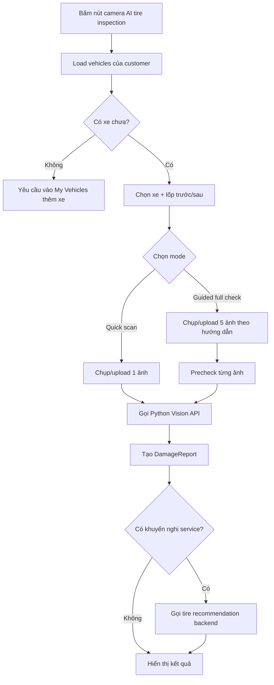

### 5.5. Quick scan

Trong `inspection_flow.dart`, Quick scan có 2 lựa chọn:

- Camera.
- Upload từ gallery.

Đặc điểm:

- Chỉ dùng 1 ảnh.
- Nhanh.
- Mức `Inspection completeness` là `Low`.
- Nếu không phát hiện lỗi, UI vẫn nhắc: đây chỉ là quick screen, không phải bằng chứng cả lốp an toàn.

### 5.6. Guided full check

Guided full check yêu cầu 5 ảnh:

1. Full tire view.
2. Center tread.
3. Left shoulder.
4. Right shoulder.
5. Sidewall.

Mỗi bước có hướng dẫn riêng và cho phép:

- Chụp ảnh trực tiếp.
- Upload ảnh tương ứng từ gallery.

Trước khi nhận ảnh vào bộ guided, app gọi `VisionApiService.precheck(...)` để kiểm tra ảnh có phù hợp không.

Ưu điểm:

- Có nhiều góc nhìn hơn.
- Tăng khả năng phát hiện mòn lệch, nứt hông lốp, vấn đề ở vai lốp.
- UI có thể hiển thị danh sách ảnh đã kiểm tra.

Hạn chế:

- Vẫn là kiểm tra qua ảnh, không thay thế đo gai lốp hoặc kiểm tra trực tiếp của kỹ thuật viên.

### 5.7. Python Vision API

File: `python-vision-api/main.py`

API chính:

| Endpoint | Mục đích |
|---|---|
| `POST /api/vision/precheck` | Kiểm tra ảnh có phù hợp để phân tích lốp không |
| `POST /api/vision/analyze` | Phân tích ảnh bằng YOLO và trả detection |

Vision API làm 4 việc:

1. Đọc ảnh upload bằng PIL.
2. Chạy precheck chất lượng ảnh và model validator `tire_validator.pt`.
3. Nếu ảnh hợp lệ, chạy YOLO damage model `best.pt`.
4. Tạo kết quả gồm `status`, `precheck`, `detections`, `total_defects_found`.

Pipeline hiện tại:

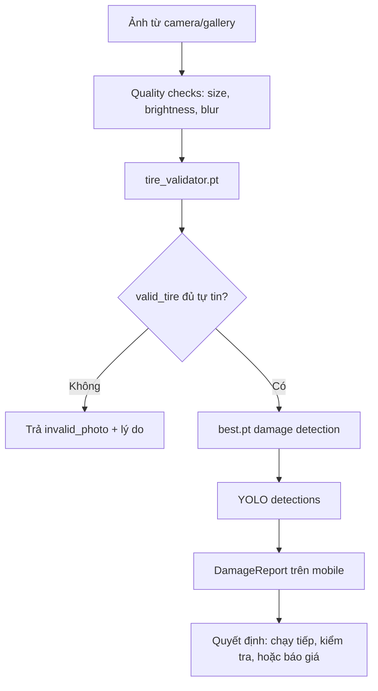

Ví dụ response hợp lệ:

```json
{
  "status": "success",
  "message": "Image analysis completed.",
  "precheck": {
    "valid": true,
    "reason": "ok"
  },
  "total_defects_found": 1,
  "detections": [
    {
      "label": "wear",
      "confidence": 0.88,
      "box": {
        "x_min": 10.2,
        "y_min": 20.1,
        "x_max": 300.5,
        "y_max": 420.8
      }
    }
  ]
}
```

Ví dụ response ảnh không hợp lệ:

```json
{
  "status": "invalid_photo",
  "message": "I could not confirm a tire in this photo. Please capture the tire, tread, or sidewall clearly.",
  "detections": [],
  "total_defects_found": 0
}
```

### 5.8. Precheck ảnh không phải lốp

Hiện tại `precheck` dùng 2 lớp kiểm tra:

1. Quality gate:
   - Kích thước ảnh.
   - Độ sáng.
   - Độ mờ.
   - Mật độ cạnh.
2. Tire validator model:
   - Model: `python-vision-api/tire_validator.pt`
   - Mục tiêu: xác nhận ảnh có đúng là lốp trước khi chạy model phân tích hư hỏng.

Các tag validator đang dùng:

| Tag | Ý nghĩa | Cách xử lý |
|---|---|---|
| `valid_tire` | Ảnh phù hợp để phân tích lốp | Cho chạy tiếp `best.pt` |
| `invalid_person` | Ảnh người/khuôn mặt | Chặn và yêu cầu chụp/upload vùng lốp |
| `invalid_house` | Ảnh phòng/nhà/bối cảnh trong nhà | Chặn và yêu cầu ảnh lốp rõ hơn |
| `invalid_scenery` | Ảnh phong cảnh | Chặn |
| `invalid_food` | Ảnh đồ ăn | Chặn |

Nếu không tìm thấy `tire_validator.pt`, backend vẫn còn fallback heuristic để tránh API chết hoàn toàn. Tuy nhiên bản demo nên chạy đúng model validator để tránh tình huống ảnh mặt người bị trả kết quả "No obvious issue".

Sơ đồ chặn ảnh không hợp lệ:

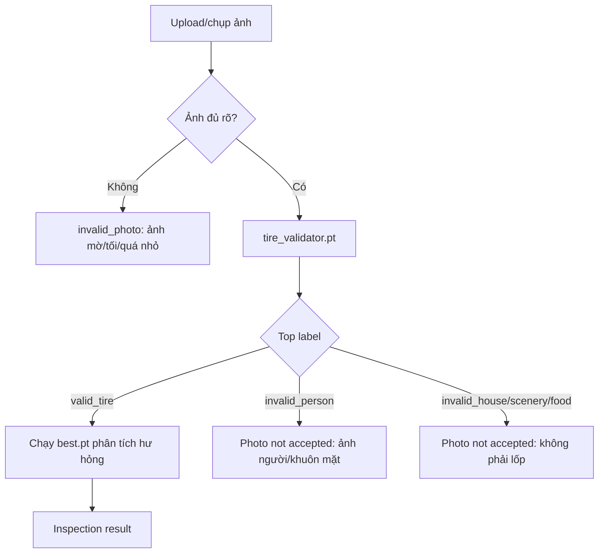

### 5.9. Chuyển detection thành báo cáo người dùng

File: `mobile_app/lib/features/inspection/services/vision_api_service.dart`

Mobile không hiển thị raw YOLO trực tiếp. Nó chuyển detections thành `DamageReport`.

`DamageReport` gồm:

| Field | Ý nghĩa |
|---|---|
| `relevant` | Ảnh có phù hợp không |
| `component` | Bộ phận, hiện cố định là `tire` |
| `hasDamage` | Có phát hiện lỗi không |
| `summary` | Tóm tắt kết quả |
| `items` | Danh sách lỗi |
| `recommendService` | Có nên gợi ý đặt lịch không |
| `mode` | Quick scan hoặc guided full check |
| `coverageLevel` | Low/Medium/High |
| `detectionConfidence` | Confidence cao nhất |
| `decisionTitle` | Kết luận chính |
| `rideAdvice` | Lời khuyên khi di chuyển |
| `nextAction` | Bước tiếp theo |

Severity được map từ confidence:

| Confidence | Severity |
|---|---|
| `>= 0.75` | Severe |
| `>= 0.50` | Moderate |
| `> 0` | Minor |

Lưu ý khi trình bày:

- Đây là rule MVP để biến kết quả model thành ngôn ngữ dễ hiểu.
- Về lâu dài có thể train model phân loại severity riêng thay vì suy ra từ confidence.

### 5.10. Màn hình kết quả inspection

File: `mobile_app/lib/features/inspection/screens/inspection_result_screen.dart`

Màn kết quả hiển thị:

- Ảnh đã phân tích.
- Chip component, mode, verdict.
- `Detection confidence`.
- `Inspection completeness`.
- Summary.
- Decision card: kết luận, ride advice, next step.
- Findings nếu có lỗi.
- Photos checked.
- Disclaimer rõ ràng.
- Nếu cần thay lốp: hiển thị transparent estimate.

Điểm UX quan trọng:

- Không dùng chữ "chắc chắn an toàn".
- Nếu quick scan không thấy lỗi, app vẫn nhắc: một ảnh không chứng minh toàn bộ lốp an toàn.
- Guided full check được gợi ý như bước tiếp theo để tăng độ bao phủ.

## 6. Báo giá minh bạch và đề xuất lốp thay thế

### 6.1. Vì sao phải chọn xe trước khi scan?

Một sản phẩm lốp chỉ phù hợp khi đúng kích thước lốp của xe. Ví dụ:

- Honda Airblade 160:
  - Lốp trước: `90/80-14M/C 43P`
  - Lốp sau: `100/80-14`
- Sản phẩm trong catalog có thể có tên: `Vỏ xe Deli SB 170 Power Storm XP 100/80-14`

Nếu app không biết người dùng đang scan xe nào và lốp trước hay sau, hệ thống không thể lọc sản phẩm chính xác.

Vì vậy luồng hiện tại yêu cầu:

1. Chọn xe.
2. Chọn lốp trước hoặc sau.
3. AI phân tích ảnh.
4. Nếu cần thay lốp, backend lấy size từ `vehicle_tire_specs`.
5. Tìm sản phẩm trong catalog có chứa size đó.
6. Hiển thị báo giá ước tính minh bạch.

### 6.2. Bảng `vehicle_tire_specs`

Entity: `backend-java/src/main/java/com/carebike/backend/features/tire/entity/VehicleTireSpec.java`

SQL: `database/vehicle_tire_specs.sql`

| Field | Ý nghĩa |
|---|---|
| `brand` | Hãng xe, ví dụ Honda |
| `vehicle_name` | Dòng xe, ví dụ Airblade |
| `vehicle_type` | Loại xe, ví dụ `XE_TAY_GA`, `XE_SO` |
| `engine_capacity` | Dung tích máy, có thể null nếu dùng chung mọi phiên bản |
| `front_tire_size` | Size lốp trước |
| `rear_tire_size` | Size lốp sau |
| `note` | Ghi chú năm đời xe/phiên bản/nguồn dữ liệu |

Web admin đã có form quản lý bảng này:

- Trang: `web-app/src/pages/VehicleTireSpecManagement.tsx`
- Modal: `web-app/src/components/modals/VehicleTireSpecModal.tsx`
- Menu sidebar: `Tire Specs`

### 6.3. API thông số lốp

Endpoint:

```http
GET /api/vehicle-tire-specs
POST /api/vehicle-tire-specs
PUT /api/vehicle-tire-specs/{id}
DELETE /api/vehicle-tire-specs/{id}
```

Form admin nhập:

- Brand.
- Vehicle Name.
- Vehicle Type.
- Engine Capacity.
- Front Tire Size.
- Rear Tire Size.
- Note.

Ý nghĩa của `engine_capacity`:

- Nếu cùng dòng xe nhưng bản 125cc và 160cc khác size lốp, cần tạo dòng riêng cho từng engine.
- Nếu mọi engine dùng chung size, có thể để engine trống như bản general.

### 6.4. API đề xuất lốp

Controller: `TireRecommendationController`

Endpoint cho customer:

```http
GET /api/tire-recommendations?vehicleId=1&position=REAR
```

Endpoint cho branch assistant:

```http
GET /api/tire-recommendations/by-spec?specId=1&position=FRONT
```

Backend xử lý:

1. Nhận `vehicleId` hoặc `specId`.
2. Xác định `position`: `FRONT` hoặc `REAR`.
3. Tìm `VehicleTireSpec` phù hợp.
4. Tách size lõi bằng regex, ví dụ từ `90/80-14M/C 43P` thành `90/80-14`.
5. Tìm trong `spare_parts.name` và `spare_parts.description`.
6. Ưu tiên category lốp qua config `carebike.tire.category-id`.
7. Sắp xếp theo giá tăng dần.
8. Trả tối đa 5 lựa chọn.

Sơ đồ đề xuất lốp và báo giá:

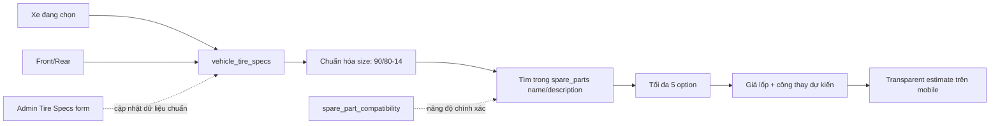

Response gồm:

- Thông tin xe/spec.
- Vị trí lốp.
- Size lốp.
- Công thay tối thiểu/tối đa.
- Disclaimer.
- Danh sách option: tên lốp, giá, estimate total, fit confidence, lý do match.

### 6.5. Vì sao gọi là "ước tính minh bạch"?

Vì hệ thống không khẳng định giá cuối cùng. UI hiển thị:

- Giá lốp từ catalog.
- Công thay dự kiến.
- Tổng ước tính.
- Lý do match theo size.
- Disclaimer rằng chi nhánh sẽ xác nhận lại tình trạng, tồn kho và giá cuối.

Đây là cách chuyên nghiệp hơn so với chỉ hiện nút "Book a service", vì người dùng thấy vì sao hệ thống đề xuất sản phẩm và khoảng chi phí dự kiến.

### 6.6. Hạn chế MVP của lọc lốp theo text

Hiện tại hệ thống lọc sản phẩm bằng size trong `name/description`, ví dụ tìm `100/80-14`.

Ưu điểm:

- Không cần thay đổi nhiều bảng `spare_parts`.
- Tận dụng được dữ liệu sản phẩm đang có.
- Làm nhanh được MVP.

Nhược điểm:

- Nếu tên sản phẩm nhập sai format thì không match.
- Nếu một sản phẩm phù hợp nhiều xe nhưng mô tả thiếu size thì bị bỏ sót.
- Không xác nhận được tương thích theo đời xe/phiên bản sâu.

Hướng nâng cấp:

- Thêm bảng `spare_part_compatibility`.
- Bảng này liên kết trực tiếp `spare_part_id` với `vehicle_tire_spec_id`, `position`, năm đời xe, ghi chú.
- Khi có bảng này, hệ thống không chỉ "tìm thấy size trong tên", mà xác nhận sản phẩm được khai báo là phù hợp.

## 7. AI tire assistant cho role branch

### 7.1. Mục tiêu

Branch dùng tính năng này như "trợ thủ đồng nghiệp online":

- Nhân viên chọn loại xe/spec.
- Chọn lốp trước hoặc sau.
- Chụp hoặc upload một ảnh.
- AI phân tích nhanh.
- Nếu có lỗi, đề xuất sản phẩm thay thế theo size lốp.

Khác với customer:

- Branch không cần luồng guided quá chi tiết.
- Branch đã có kỹ thuật viên, nên AI chỉ hỗ trợ nhận định nhanh, không thay thế chuyên môn.
- Branch chọn trực tiếp từ bảng `vehicle_tire_specs`, không cần xe thuộc sở hữu của customer.

### 7.2. File chính

- `mobile_app/lib/features/branch/screens/branch_dashboard.dart`
- `mobile_app/lib/features/branch/screens/branch_tire_assistant_screen.dart`
- `mobile_app/lib/features/inspection/services/vehicle_tire_spec_service.dart`
- `mobile_app/lib/features/inspection/services/vision_api_service.dart`
- `mobile_app/lib/features/inspection/services/tire_recommendation_service.dart`

### 7.3. Luồng branch tire assistant

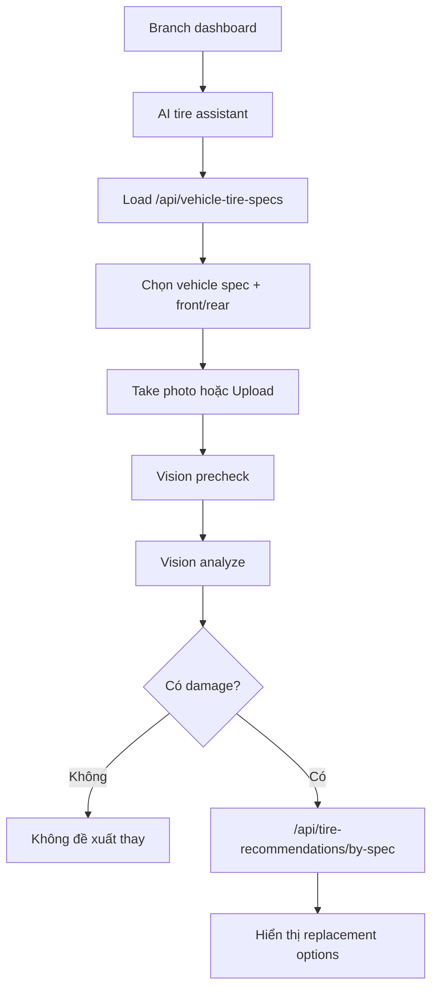

### 7.4. Giá trị thực tế

Điểm nhấn khi trình bày:

- Customer app giúp người dùng tự kiểm tra sơ bộ.
- Branch app giúp nhân viên kiểm tra nhanh hơn, chuẩn hóa bước tư vấn.
- Cả hai dùng chung Vision API và Tire Recommendation backend, tránh viết logic trùng.

Sơ đồ dùng chung lõi AI/backend:

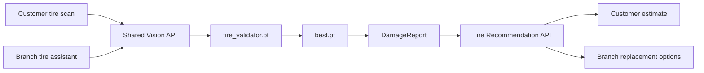

## 8. Bảng API liên quan

| Nhóm | Endpoint | Mục đích | Actor |
|---|---|---|---|
| Auth | `POST /api/auth/register` | Đăng ký customer sau khi Firebase tạo user | Customer mobile |
| Auth | `POST /api/auth/login` | Đồng bộ Firebase token và lấy role | Mobile/Web |
| Auth | `GET /api/auth/me` | Khôi phục phiên web khi refresh | Web |
| Staff | `POST /api/auth/create-staff` | Admin tạo tài khoản branch manager | Admin |
| User | `GET /api/users` | Lấy danh sách user | Admin UI |
| User | `PUT /api/users/{id}/toggle-status` | Khóa/mở user | Admin |
| User | `DELETE /api/users/{id}` | Xóa staff account | Admin |
| Vehicle | `GET /api/vehicles/owner/{userId}` | Lấy xe của customer | Customer/chatbot/inspection |
| Vehicle | `PUT /api/vehicles/owner/{userId}` | Tạo/cập nhật xe | Customer |
| AI Chat | `POST /api/ai/consult` | Chatbot tư vấn bảo dưỡng | Authenticated users |
| Vision | `POST /api/vision/precheck` | Kiểm tra ảnh phù hợp | Mobile app |
| Vision | `POST /api/vision/analyze` | YOLO phân tích ảnh | Mobile app |
| Tire Spec | `GET /api/vehicle-tire-specs` | Lấy thông số lốp | Admin/Branch |
| Tire Spec | `POST /api/vehicle-tire-specs` | Tạo thông số lốp | Admin |
| Tire Quote | `GET /api/tire-recommendations` | Gợi ý lốp theo xe customer | Customer |
| Tire Quote | `GET /api/tire-recommendations/by-spec` | Gợi ý lốp theo spec branch chọn | Branch |
| Appointment | `POST /api/appointments` | Tạo lịch hẹn | Customer/Branch/Admin |

## 9. Điểm mạnh để nhấn trong buổi bảo vệ

### 9.1. Kiến trúc tách lớp rõ

- Flutter không xử lý nghiệp vụ nhạy cảm như role.
- Backend kiểm soát xác thực, phân quyền và dữ liệu.
- Vision AI chạy riêng, có thể thay model mà ít ảnh hưởng mobile/backend.
- Gemini chỉ sinh câu trả lời, còn dữ liệu nghiệp vụ lấy từ database.

### 9.2. Tính năng AI có tính ứng dụng

Chatbot:

- Không chỉ hỏi đáp.
- Có ngữ cảnh xe và lịch sử bảo dưỡng.
- Có thẻ sức khỏe và action button.

Vision tire inspection:

- Có quick scan và guided full check.
- Có precheck ảnh.
- Có báo giá lốp minh bạch.
- Có branch assistant hỗ trợ nhân viên.

### 9.3. UX an toàn

- Không khẳng định tuyệt đối lốp an toàn chỉ qua ảnh.
- Luôn có disclaimer.
- AI chỉ đề xuất, người dùng hoặc kỹ thuật viên vẫn là người quyết định.
- Báo giá ghi rõ là ước tính, chi nhánh xác nhận giá cuối.

### 9.4. Dữ liệu nghiệp vụ được chuẩn hóa dần

Ban đầu catalog phụ tùng thiếu field tương thích. Project giải quyết bằng:

1. Thêm `vehicle_tire_specs`.
2. Admin có form nhập dữ liệu.
3. MVP lọc sản phẩm theo size trong name/description.
4. Tương lai thêm `spare_part_compatibility` để match chính xác.

## 10. Hạn chế hiện tại và hướng phát triển

### 10.1. Auth và security

Hạn chế:

- Một số API hiện đang rơi vào rule `.anyRequest().authenticated()` thay vì khai báo role cụ thể.
- Có phần interceptor web còn dấu vết refresh-token cũ, trong khi hiện tại hệ thống chính dùng Firebase ID token.

Hướng phát triển:

- Gắn role rõ hơn cho `/api/users`, `/api/branches`, `/api/vehicle-tire-specs`, `/api/tire-recommendations`.
- Chuẩn hóa lại interceptor web theo Firebase token lifecycle.
- Đưa toàn bộ secret như Gemini key, Firebase service account, DB password ra biến môi trường hoặc secret manager.

### 10.2. Chatbot

Hạn chế:

- Intent detection đang dựa vào keyword.
- RAG là structured RAG từ SQL, chưa có vector search.
- Chưa có conversation memory dài hạn theo từng phiên chat.

Hướng phát triển:

- Lưu lịch sử chat.
- Thêm bảng knowledge base về bảo dưỡng.
- Dùng embedding/vector database cho tài liệu kỹ thuật, hướng dẫn, FAQ.
- Cho chatbot sinh JSON action nghiêm ngặt thay vì vừa text vừa actions.

### 10.3. Vision AI

Hạn chế:

- Model `best.pt` hiện tập trung vào phát hiện damage, chưa phải validator chuyên nhận diện ảnh có phải lốp hay không.
- Precheck ảnh không hợp lệ hiện vẫn còn heuristic.
- Severity đang suy ra từ confidence, chưa phải severity classifier riêng.

Hướng phát triển:

- Train thêm model validator:
  - `tire`
  - `not_tire`
  - `person`
  - `sensitive`
  - `object/food/scenery`
- Chạy validator trước damage model.
- Nếu validator không chắc, yêu cầu người dùng chụp lại thay vì phân tích.
- Thêm đo độ sâu gai lốp bằng ảnh có vật chuẩn hoặc AR/calibration.

### 10.4. Báo giá phụ tùng

Hạn chế:

- Lọc sản phẩm bằng text size trong name/description có thể thiếu chính xác.
- Chưa kiểm tra tồn kho theo chi nhánh.
- Chưa có luồng giữ phụ tùng.

Hướng phát triển:

- Thêm `spare_part_compatibility`.
- Thêm tồn kho theo chi nhánh.
- Thêm giữ phụ tùng trong thời gian ngắn khi người dùng chọn lịch.
- Khi branch xác nhận, chuyển từ estimate sang quote cuối.

## 11. Gợi ý kịch bản trình bày

### 11.1. Mở đầu

"CareBike là ứng dụng hỗ trợ bảo dưỡng và cứu hộ xe máy. Điểm chính của hệ thống là kết hợp app mobile, web admin và AI để giúp khách hàng đặt lịch, theo dõi lịch sử bảo dưỡng, nhận tư vấn thông minh và kiểm tra nhanh tình trạng lốp qua ảnh."

### 11.2. Trình bày auth

"Em sử dụng Firebase Authentication để đảm bảo an toàn cho đăng nhập và quản lý mật khẩu. Backend Spring Boot không tin trực tiếp dữ liệu từ client mà verify Firebase ID token bằng Firebase Admin SDK. Sau khi verify, backend tra bảng users để lấy role và phân quyền bằng Spring Security."

### 11.3. Trình bày role

"Hệ thống có ba role chính: ADMIN, BRANCH và CUSTOMER. Role được seed ở backend, không cho client tự gửi role. Admin có thể tạo tài khoản quản lý chi nhánh trên web, nhưng backend mới là nơi gán role BRANCH cho tài khoản đó."

### 11.4. Trình bày chatbot

"Chatbot của em không chỉ gọi Gemini trả lời chung chung. Backend trước tiên lấy dữ liệu xe, số km, lịch hẹn và lịch sử bảo dưỡng từ database. Sau đó backend build prompt có ngữ cảnh, gọi Gemini và trả về cả câu trả lời, thẻ sức khỏe xe và nút hành động như đặt lịch, quét lốp, cứu hộ."

### 11.5. Trình bày AI tire inspection

"Với phân tích lốp, em không cho AI kết luận tuyệt đối dựa trên một ảnh. Em chia thành Quick scan và Guided full check. Quick scan nhanh nhưng coverage thấp. Guided full check yêu cầu 5 góc chụp để tăng độ bao phủ. Kết quả được tách thành detection confidence và inspection completeness để người dùng hiểu giới hạn của AI."

### 11.6. Trình bày báo giá minh bạch

"Sau khi AI phát hiện lốp có vấn đề, hệ thống không chỉ chuyển sang đặt lịch. Nó lấy xe đang chọn, lốp trước/sau, tra bảng vehicle_tire_specs để biết size lốp, sau đó lọc catalog phụ tùng theo size và hiển thị báo giá ước tính gồm giá lốp, công thay và tổng dự kiến. Giá này được ghi rõ là ước tính, chi nhánh sẽ xác nhận lại tồn kho và giá cuối."

## 12. Câu hỏi phản biện thường gặp và cách trả lời

### Câu 1: Vì sao không tự viết đăng nhập mà dùng Firebase?

Vì đăng nhập là phần nhạy cảm về bảo mật. Firebase đã hỗ trợ password hashing, Google Sign-In, email verification, reset password và token lifecycle. Backend vẫn giữ quyền kiểm soát nghiệp vụ bằng cách verify token rồi lấy role từ database CareBike.

### Câu 2: Frontend RoleRoute có đủ bảo mật không?

Không. RoleRoute chỉ giúp điều hướng giao diện. Bảo mật thật nằm ở backend bằng `JwtAuthenticationFilter`, `SecurityConfig` và `@PreAuthorize`. Nếu user giả request bằng Postman, backend vẫn phải kiểm tra token và role.

### Câu 3: Chatbot có phải RAG không?

Có, nhưng là RAG dạng dữ liệu có cấu trúc. Backend retrieve dữ liệu từ SQL Server như xe, lịch hẹn, lịch sử bảo dưỡng rồi đưa vào prompt cho Gemini. Hiện chưa dùng vector database, nhưng vẫn là cách bổ sung dữ liệu ngoài model trước khi sinh câu trả lời.

### Câu 4: Vì sao bắt buộc chọn xe trước khi scan lốp?

Vì cùng một ảnh lốp không cho biết chắc xe đang dùng size nào. Để đề xuất lốp thay thế, hệ thống phải biết brand, model, loại xe, dung tích máy và lốp trước/sau. Những dữ liệu này được map qua bảng `vehicle_tire_specs`.

### Câu 5: Vì sao cần Quick scan và Guided full check?

Một ảnh chỉ thấy một vùng của lốp, không đủ để kết luận toàn bộ lốp an toàn. Quick scan phục vụ nhu cầu kiểm tra nhanh lỗi rõ ràng. Guided full check yêu cầu nhiều góc chụp để tăng độ bao phủ và giảm rủi ro bỏ sót.

### Câu 6: AI có thể nhận nhầm ảnh người thành ảnh lốp không?

Có thể, nếu chỉ dùng model damage hoặc heuristic đơn giản. Hiện hệ thống có precheck để giảm rủi ro, nhưng hướng đúng là train thêm model validator để phân loại ảnh hợp lệ trước khi chạy model damage.

### Câu 7: Báo giá có chính xác tuyệt đối không?

Không. Đây là báo giá ước tính minh bạch. Hệ thống dựa trên size lốp và catalog hiện có để tính khoảng giá. Chi nhánh vẫn cần xác nhận tình trạng thực tế, tồn kho và giá cuối trước khi thay.

### Câu 8: Nếu Gemini lỗi thì chatbot có dùng được không?

Có mức fallback cơ bản. Backend có rule-based reply để trả lời an toàn theo intent chính như dầu nhớt, lốp, phanh, cứu hộ, đặt lịch. Người dùng không bị màn hình lỗi trắng.

## 13. Checklist demo nhanh

### Demo đăng ký/đăng nhập

1. Mở mobile.
2. Đăng ký customer bằng email/password.
3. Xác thực email.
4. Đăng nhập lại.
5. Backend trả role `CUSTOMER`, mobile vào MainScreen.

### Demo web admin/role

1. Đăng nhập admin trên web.
2. Vào Staff Management.
3. Tạo tài khoản branch manager.
4. Vào Branch Management gán manager cho chi nhánh.
5. Đăng nhập tài khoản branch và thấy dashboard chi nhánh.

### Demo chatbot

1. Customer có ít nhất một xe.
2. Mở Support.
3. Chọn xe.
4. Hỏi "When should I change my oil?"
5. Quan sát reply, health card và nút Book oil service.
6. Bấm booking để Home điền sẵn xe/ghi chú.

### Demo AI tire inspection customer

1. Customer có xe đã lưu.
2. Bấm nút camera giữa Home.
3. Chọn xe và lốp trước/sau.
4. Chọn Quick scan hoặc Guided full check.
5. Upload/chụp ảnh lốp mòn.
6. Xem kết quả confidence, completeness, decision card.
7. Nếu damage đủ nặng, xem transparent estimate.

### Demo branch tire assistant

1. Đăng nhập branch mobile.
2. Vào AI tire assistant.
3. Chọn vehicle spec từ bảng `vehicle_tire_specs`.
4. Chọn lốp trước/sau.
5. Chụp/upload ảnh.
6. Xem nhận định nhanh và replacement options.

## 14. File map theo chức năng

### Auth mobile

- `mobile_app/lib/features/auth/providers/auth_provider.dart`
- `mobile_app/lib/features/auth/screens/login_screen.dart`
- `mobile_app/lib/features/auth/screens/register_screen.dart`
- `mobile_app/lib/app/auth_wrapper.dart`

### Auth web

- `web-app/src/context/AuthContext.tsx`
- `web-app/src/services/authService.ts`
- `web-app/src/pages/Login.tsx`
- `web-app/src/routes/ProtectedRoute.tsx`
- `web-app/src/routes/RoleRoute.tsx`
- `web-app/src/App.tsx`

### Auth backend

- `backend-java/src/main/java/com/carebike/backend/features/auth/controller/AuthController.java`
- `backend-java/src/main/java/com/carebike/backend/features/auth/controller/UserController.java`
- `backend-java/src/main/java/com/carebike/backend/features/auth/service/UserService.java`
- `backend-java/src/main/java/com/carebike/backend/features/auth/entity/User.java`
- `backend-java/src/main/java/com/carebike/backend/features/auth/entity/Role.java`
- `backend-java/src/main/java/com/carebike/backend/security/JwtAuthenticationFilter.java`
- `backend-java/src/main/java/com/carebike/backend/config/SecurityConfig.java`
- `backend-java/src/main/java/com/carebike/backend/config/FirebaseConfig.java`
- `backend-java/src/main/java/com/carebike/backend/config/DataSeeder.java`

### Role/admin/staff

- `web-app/src/pages/StaffManagement.tsx`
- `web-app/src/components/modals/StaffModal.tsx`
- `web-app/src/services/userService.ts`
- `backend-java/src/main/java/com/carebike/backend/features/branch/controller/BranchController.java`
- `backend-java/src/main/java/com/carebike/backend/features/branch/service/BranchService.java`

### Chatbot

- `mobile_app/lib/features/chat/screens/support_chat_screen.dart`
- `backend-java/src/main/java/com/carebike/backend/features/ai/controller/AiController.java`
- `backend-java/src/main/java/com/carebike/backend/features/ai/service/GeminiApiService.java`
- `backend-java/src/main/java/com/carebike/backend/features/ai/dto/AiConsultRequest.java`
- `backend-java/src/main/java/com/carebike/backend/features/ai/dto/AiConsultResponse.java`
- `backend-java/src/main/java/com/carebike/backend/features/ai/dto/AiHealthCard.java`
- `backend-java/src/main/java/com/carebike/backend/features/ai/dto/AiSuggestedAction.java`

### AI tire inspection

- `mobile_app/lib/features/home/main_screen.dart`
- `mobile_app/lib/features/inspection/screens/inspection_flow.dart`
- `mobile_app/lib/features/inspection/screens/inspection_result_screen.dart`
- `mobile_app/lib/features/inspection/services/vision_api_service.dart`
- `mobile_app/lib/features/inspection/models/damage_models.dart`
- `python-vision-api/main.py`
- `python-vision-api/best.pt`

### Tire specs và báo giá

- `backend-java/src/main/java/com/carebike/backend/features/tire/controller/TireRecommendationController.java`
- `backend-java/src/main/java/com/carebike/backend/features/tire/service/TireRecommendationService.java`
- `backend-java/src/main/java/com/carebike/backend/features/tire/controller/VehicleTireSpecController.java`
- `backend-java/src/main/java/com/carebike/backend/features/tire/service/VehicleTireSpecService.java`
- `backend-java/src/main/java/com/carebike/backend/features/tire/entity/VehicleTireSpec.java`
- `web-app/src/pages/VehicleTireSpecManagement.tsx`
- `web-app/src/components/modals/VehicleTireSpecModal.tsx`
- `database/vehicle_tire_specs.sql`

### Branch AI tire assistant

- `mobile_app/lib/features/branch/screens/branch_dashboard.dart`
- `mobile_app/lib/features/branch/screens/branch_tire_assistant_screen.dart`
- `mobile_app/lib/features/inspection/models/vehicle_tire_spec_models.dart`
- `mobile_app/lib/features/inspection/services/vehicle_tire_spec_service.dart`
